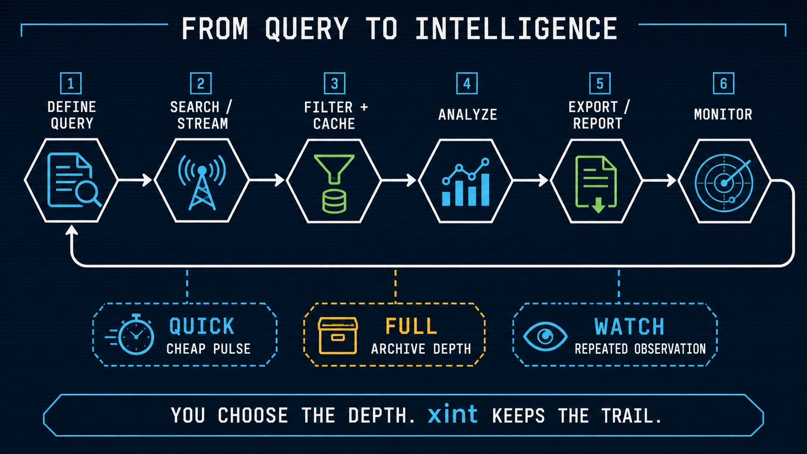
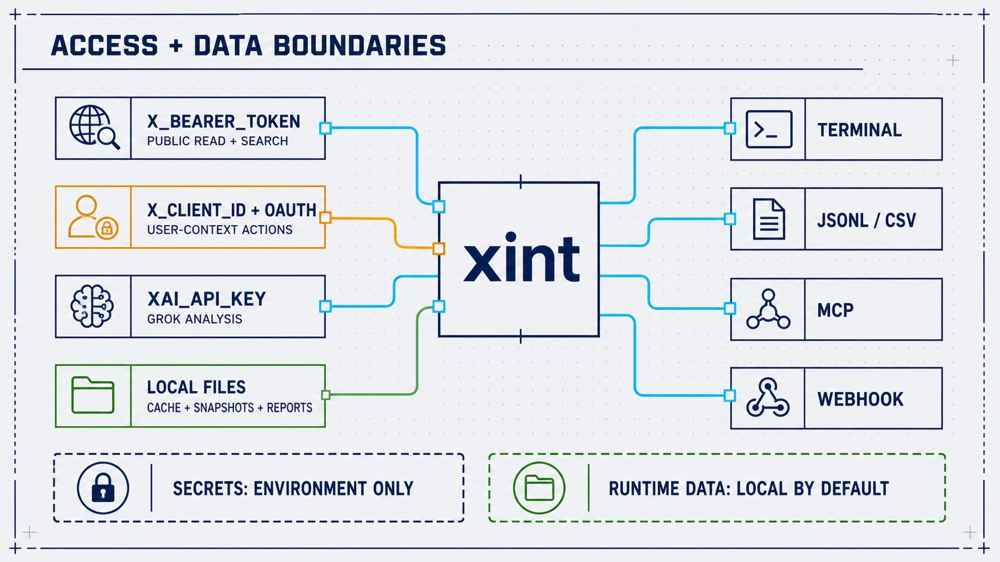

<!-- markdownlint-disable MD041 -->
<p align="center">
  
</p>

<p align="center">
  <strong>Search, monitor, analyze, and export X data from the terminal.</strong>
</p>

<p align="center">
  <a href="LICENSE"></a>
  <a href="https://bun.sh"></a>
  <a href="https://github.com/0xNyk/xint/releases"></a>
  <a href="https://github.com/0xNyk/xint"></a>
</p>

---

`xint` is a local-first TypeScript CLI for X API research and operations. It supports recent and full-archive search, filtered streams, watch loops, account and follower analysis, OAuth actions, Grok-assisted analysis, structured exports, and an MCP interface for agents.

It uses official X and xAI APIs. You bring the credentials, choose the scope, and keep cache, snapshots, and reports on your machine by default.

> **Project status:** actively maintained. Latest release: [`2026.7.5`](https://github.com/0xNyk/xint/releases/tag/2026.7.5). Runtime: Bun 1.0+.

## What xint is for

| Need | What xint provides |
|---|---|
| Research | Search, threads, profiles, trends, reposts, articles, and reports |
| Monitoring | Watch loops, filtered streams, follower snapshots, and webhooks |
| Analysis | Local filtering plus optional Grok sentiment and synthesis |
| Automation | JSON, JSONL, CSV, MCP, shell pipelines, and machine-readable capabilities |
| Account operations | OAuth-backed bookmarks, likes, follows, lists, blocks, and mutes |

It is a spiritual successor to [twint](https://github.com/twintproject/twint), rebuilt around official APIs instead of scraping.

## Install

The release installer verifies the source archive against the release checksum. Download it first so you can inspect what will run:

```bash
curl -fsSLo /tmp/xint-install.sh \
  https://raw.githubusercontent.com/0xNyk/xint/2026.7.5/install.sh
XINT_INSTALL_VERSION=2026.7.5 bash /tmp/xint-install.sh
```

Install the latest published release instead:

```bash
curl -fsSLo /tmp/xint-install.sh \
  https://raw.githubusercontent.com/0xNyk/xint/main/install.sh
bash /tmp/xint-install.sh
```

Homebrew (lightweight prebuilt binary on Apple Silicon):

```bash
brew tap 0xNyk/xint
brew install xint
```

Rust variant explicitly:

```bash
brew install xint-rs
```

Manual source install:

```bash
git clone https://github.com/0xNyk/xint.git
cd xint
bun install
```

> **Requires:** [Bun](https://bun.sh) and prepaid [X API access](https://console.x.com).

## From query to intelligence



## Quick Reference

| Task | Command |
|------|---------|
| Search | `xint search "AI agents"` |
| Monitor | `xint watch "solana" -i 5m` |
| Stream | `xint stream` |
| Profile | `xint profile @elonmusk` |
| Thread | `xint thread 123456789` |
| Followers | `xint diff @username` |
| Bookmarks | `xint bookmarks` |
| Lists | `xint lists` |
| Blocks | `xint blocks` |
| Mutes | `xint mutes` |
| Follow | `xint follow @username` |
| Media | `xint media <tweet_id>` |
| Trends | `xint trends` |
| AI Analyze | `xint analyze "best AI frameworks?"` |
| Report | `xint report "crypto"` |
| Reposts | `xint reposts <tweet_id>` |
| User Search | `xint users "AI researcher"` |
| Article | `xint article <url> --ai "summarize"` |
| Capabilities | `xint capabilities --json` |
| TUI | `xint tui` |

### Shorthands

```bash
xint s "query"    # search
xint w "query"    # watch  
xint p @user     # profile
xint tr           # trends
xint bm           # bookmarks
```

### TUI Customization

```bash
# Built-in themes: classic | neon | minimal | ocean | amber
XINT_TUI_THEME=ocean xint tui

# Disable animated hero line
XINT_TUI_HERO=0 xint tui

# Disable icons in menu rows
XINT_TUI_ICONS=0 xint tui

# Force ASCII borders
XINT_TUI_ASCII=1 xint tui

# Optional theme token file
XINT_TUI_THEME_FILE=./tui-theme.tokens.example.json xint tui
```

## Setup



### 1. X API Key

Set a local bearer token in your shell or secret manager (do not commit credentials):
- `X_BEARER_TOKEN`

Get your bearer token from the [X Developer Console](https://console.x.com) under your app's credentials.

### 2. Optional: xAI for AI Features

For `analyze`, `report --sentiment`, and `article --ai`:

- `XAI_API_KEY`

### 3. Optional: OAuth for Write Access

For bookmarks, likes, lists, blocks/mutes, and follower tracking:

- `X_CLIENT_ID`

Run `xint auth setup` to complete OAuth flow.

## Deployment Modes

### Self-hosted (OSS default)

- Run everything locally from this repo.
- Package API calls are local unless you set cloud endpoints.
- Good for development and private workflows.

### Hosted cloud control plane (`xint-cloud`)

- Point package API features at your hosted control plane:
  - `XINT_PACKAGE_API_BASE_URL=http://localhost:8787/v1` (or your deployed URL)
  - `XINT_PACKAGE_API_KEY=<workspace_api_key>`
  - `XINT_WORKSPACE_ID=<workspace_id>`
- Optional billing upgrade link shown on quota/plan errors:
  - `XINT_BILLING_UPGRADE_URL=https://your-app/pricing`

Notes:
- If `XINT_PACKAGE_API_BASE_URL` is unset, package API MCP tools return a setup error.
- `xint-cloud` should remain private; `xint` and `xint-rs` stay public OSS clients.

## Agent-Native Capabilities Manifest

`xint` now ships a machine-readable manifest for agent runtime allowlists and tool routing:

```bash
# Pretty JSON
xint capabilities

# Compact JSON for machine ingestion
xint capabilities --compact
```

## Search

```bash
# Quick pulse
xint search "AI agents" --quick

# High-engagement from last hour
xint search "react 19" --since 1h --sort likes --min-likes 50

# Full-archive deep dive
xint search "bitcoin ETF" --full --pages 3

# With sentiment
xint search "solana" --sentiment

# Export
xint search "startups" --csv > data.csv
xint search "AI" --jsonl | jq '.text'
```

### Options

| Flag | Description |
|------|-------------|
| `--sort` | `likes` · `impressions` · `retweets` · `recent` |
| `--since` | `1h` · `3h` · `12h` · `1d` · `7d` |
| `--full` | Search full archive (back to 2006) |
| `--min-likes N` | Filter by engagement |
| `--pages N` | Pages to fetch (1-5) |
| `--sentiment` | Add AI sentiment per tweet |
| `--quick` | Fast mode with caching |

## Watch (Real-Time)

```bash
# Monitor topic every 5 minutes
xint watch "solana" --interval 5m

# Watch user
xint watch "@vitalikbuterin" -i 1m

# Webhook to Slack
xint watch "breaking" -i 30s --webhook https://example.com/webhook
```

Webhook safety:
- Remote webhooks must use `https://`
- `http://` is accepted only for localhost/loopback targets
- Optional host allowlist: `XINT_WEBHOOK_ALLOWED_HOSTS=hooks.example.com,*.internal.example`

Press `Ctrl+C` to stop and show session stats.

## Stream (Official Filtered Stream)

```bash
# List current stream rules
xint stream-rules

# Add a filtered-stream rule
xint stream-rules add "from:elonmusk -is:retweet" --tag elon

# Connect to stream
xint stream

# JSONL output + stop after 25 events
xint stream --jsonl --max-events 25
```

## Follower Tracking

```bash
# First run: creates snapshot
xint diff @vitalikbuterin

# Second run: shows changes
xint diff @vitalikbuterin

# Track following
xint diff @username --following
```

Requires OAuth (`xint auth setup`).

## Lists (OAuth)

```bash
# List your owned lists
xint lists

# Create a private list
xint lists create "AI Researchers" --description "High-signal accounts" --private

# Add/remove members
xint lists members add <list_id> @username
xint lists members remove <list_id> @username
```

## Blocks & Mutes (OAuth)

```bash
# List blocked/muted users
xint blocks
xint mutes

# Add/remove
xint blocks add @username
xint blocks remove @username
xint mutes add @username
xint mutes remove @username
```

## Follow Actions (OAuth)

```bash
xint follow @username
xint unfollow @username
```

## Media Download

```bash
# Download media from a tweet ID
xint media 1900100012345678901

# Download media from a tweet URL
xint media https://x.com/user/status/1900100012345678901

# Custom output directory + JSON summary
xint media 1900100012345678901 --dir ./downloads --json

# Download only first video/gif
xint media 1900100012345678901 --video-only --max-items 1

# Download only photos
xint media 1900100012345678901 --photos-only

# Custom filename template
xint media 1900100012345678901 --name-template "{username}-{created_at}-{index}"
```

## Reposts

```bash
# See who reposted a tweet
xint reposts <tweet_id>
xint reposts <tweet_id> --limit 50 --json
```

## User Search

```bash
# Find users by keyword
xint users "AI researcher"
xint users "solana dev" --limit 10 --json
```

## Intelligence Reports

```bash
# Generate report
xint report "AI agents" --save

# With sentiment + specific accounts
xint report "crypto" --sentiment --accounts @aaboronkov,@solana
```

Reports include: summary, sentiment breakdown, top tweets, account activity.

## Article Analysis

```bash
# Fetch article
xint article "https://example.com"

# Fetch + AI summary
xint article "https://example.com" --ai "Key takeaways?"

# From X tweet
xint article "https://x.com/user/status/123" --ai "Summarize"
```

Uses xAI's `grok-4.3` model. Since the 2026-05-15 model retirement, requests using retired slugs such as `grok-4-1-fast` and `grok-3` redirect to `grok-4.3` and use its rates.

## Use as AI Agent Skill

Designed for AI coding agents. Add as a skill:

```bash
# Claude Code
mkdir -p .claude/skills && cd .claude/skills
git clone https://github.com/0xNyk/xint.git

# OpenClaw
mkdir -p skills && cd skills
git clone https://github.com/0xNyk/xint.git
```

Ask: *"Search X for what people say about React 19."* The agent reads `SKILL.md` and selects the matching command.

### MCP Server

```bash
xint mcp
```

Runs an MCP server AI agents can connect to.

```bash
# HTTP/SSE mode (local-only by default)
xint mcp --sse --port=3000

# Optional: require bearer auth (recommended if binding beyond loopback)
XINT_MCP_AUTH_TOKEN=replace-with-long-random-token xint mcp --sse --host=127.0.0.1
```

Security defaults:
- SSE mode binds to `127.0.0.1` unless `--host` / `XINT_MCP_HOST` is set.
- If host is non-loopback, auth is required via `--auth-token` or `XINT_MCP_AUTH_TOKEN`.

## Cost awareness


X uses prepaid, operation-specific pricing. `xint` records local estimates and exposes budget controls, but the X Developer Console is authoritative for current rates and billed usage. See the [official X API pricing page](https://docs.x.com/x-api/getting-started/pricing).

```bash
xint costs           # Today's spend
xint costs week      # Last 7 days
xint costs budget    # Show/set limits
```

## Package API Billing

```bash
# Show workspace plan, limits, and feature gates
xint billing status

# Show usage units by operation over a window
xint billing usage --days=30
```

These commands read from the local/hosted package API (`XINT_PACKAGE_API_BASE_URL`).

For hosted billing sync, package API also supports:
- `POST /v1/billing/webhook` (provider-agnostic event ingest)
- `GET /v1/billing/events?limit=100` (workspace billing event history)

## Configuration variables

| Variable | Required | Description |
|----------|----------|-------------|
| `X_BEARER_TOKEN` | Yes | X API v2 bearer token |
| `XAI_API_KEY` | No | xAI key for analyze/report |
| `XINT_ARTICLE_TIMEOUT_SEC` | No | Article fetch timeout seconds (default 30, range 5-120) |
| `X_CLIENT_ID` | No | OAuth for bookmarks/likes/lists/blocks/mutes |
| `XINT_PACKAGE_API_BASE_URL` | No | Package API base URL for MCP package tools/billing |
| `XINT_PACKAGE_API_KEY` | No | Legacy single bearer key for package API auth |
| `XINT_PACKAGE_API_KEYS` | No | JSON map of API keys to `workspace_id` + `plan` |
| `XINT_PACKAGE_API_PLAN` | No | Default workspace plan (`free\|pro\|team\|enterprise`) |
| `XINT_WORKSPACE_ID` | No | Workspace id used by local `xint billing *` calls |
| `XINT_BILLING_WEBHOOK_SECRET` | No | HMAC secret for `/v1/billing/webhook` signature validation |
| `XINT_BILLING_UPGRADE_URL` | No | Upgrade URL shown in MCP plan/quota errors |

## File structure

```
xint/
├── xint.ts              # CLI entry
├── lib/                 # Core modules
│   ├── api.ts          # X API wrapper
│   ├── oauth.ts        # OAuth 2.0 PKCE
│   ├── grok.ts         # xAI integration
│   ├── sentiment.ts    # AI sentiment
│   ├── watch.ts        # Real-time monitoring
│   └── format.ts       # Output formatters
├── data/
│   ├── cache/          # Search cache (15min TTL)
│   ├── exports/        # Saved results
│   └── snapshots/      # Follower snapshots
├── SKILL.md            # AI agent instructions
└── .env.example        # Template
```

## Security

- Tokens come from environment variables and are never hardcoded
- OAuth tokens stored with `chmod 600`
- Webhooks: use trusted endpoints only
- Review agent session logs in untrusted environments

See [SECURITY.md](SECURITY.md) for supported versions and private reporting instructions.

## Release Automation

`xint` is the source of truth for release automation across `xint` and `xint-rs`.

```bash
# from xint/
./scripts/release.sh --dry-run --allow-dirty
./scripts/release.sh 2026.2.18.4 --allow-dirty
# disable default ClawdHub publish for one run
./scripts/release.sh 2026.2.18.4 --no-clawdhub
# enable skills.sh as well
./scripts/release.sh 2026.2.18.4 --skillsh
# disable GitHub auto-generated notes if you want manual sections only
./scripts/release.sh 2026.2.18.4 --no-auto-notes
# write release report to a custom location
./scripts/release.sh 2026.2.18.4 --report-dir /tmp/xint-release-reports
```

Optional path overrides:

- `REPO_PATH_XINT` (defaults to current repo when running inside `xint`)
- `REPO_PATH_XINT_RS` (defaults to sibling `../xint-rs` when present)
- `RELEASE_REPORT_DIR` (defaults to `xint/reports/releases`)

Notes behavior:

- Default: uses `gh release create --generate-notes`
- Manual override: set any of `CHANGELOG_ADDED`, `CHANGELOG_CHANGED`, `CHANGELOG_FIXED`, `CHANGELOG_SECURITY`
- Default: publishes to ClawdHub when `clawdhub` CLI is available (disable with `--no-clawdhub`)
- Optional: publish to skills.sh with `--skillsh` (or `--ai-skill` for both)

Release report:

- Default: writes `reports/releases/<version>.md`
- Contains per-repo commit list, commit range, file changes, SHAs, compare links, and release URLs
- Uploaded automatically to both GitHub releases as an asset (can disable with `--no-report-asset`)
- Embedded automatically in both GitHub release bodies (can disable with `--no-report-body`)
- Disable with `--no-report`


## Contributing and support

Read [CONTRIBUTING.md](CONTRIBUTING.md) before opening a pull request. Use [GitHub Issues](https://github.com/0xNyk/xint/issues) for reproducible bugs and scoped feature requests. Security reports belong in the private channel described in [SECURITY.md](SECURITY.md), not in public issues.

## Support the project

If you find this project useful, consider supporting my open-source work.

[](https://buymeacoffee.com/nyk_builderz)

**Solana donations**

`2k1oq9U99mwy4gm8P2hXPJoZusoXQCpFs35EEf5Ve73y`


---

<div align="center">

**Need agent infrastructure, trading systems, or Solana applications built for your team?**

[Builderz](https://builderz.dev) builds production AI systems, trading infrastructure, and Solana applications.

[Get in touch](https://builderz.dev) | [@nyk_builderz](https://x.com/nyk_builderz)

</div>

## License

Licensed under the [MIT License](LICENSE).
